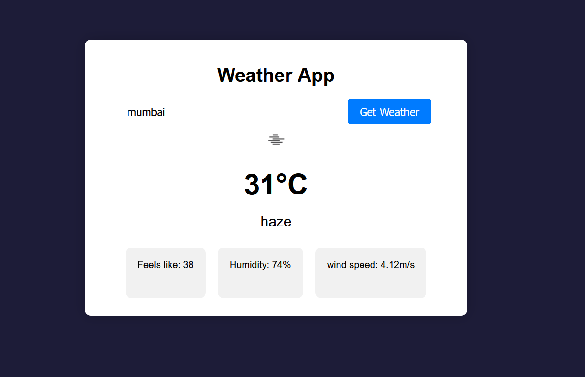

# Weather-App


This repository contains a Weather WebApp that provides current weather information for a given location. The application leverages the OpenWeather API to retrieve weather data and displays it in a user-friendly interface.
## Features
- Current weather information: The web application fetches and displays the current weather conditions, including temperature, humidity, wind speed, and weather     description, for a specified location.
- Search functionality: Users can enter a location to retrieve the weather information for that specific place.
- Responsive design: The application is designed to be responsive and adapt to different screen sizes, providing a consistent user experience across devices.

## Technologies Used
The Weather WebApp is built using the following technologies: 
- HTML: Markup language for creating the structure and content of the application.
- CSS: Stylesheets for applying styles and enhancing the visual appearance of the web pages.
- JavaScript: Programming language used for implementing the application's functionality.
- OpenWeather API: External API used to retrieve weather data based on the user's location.

## Usage

To use the Weather WebApp, follow these steps:

1. Clone the repository to your local machine using the following command:

``` bash
git clone https://github.com/your-username/weather-webapp.git
```

2. Open the index.html file in a web browser.

3. Enter the desired location in the search bar and click the "Search" button.

4. The web application will fetch the weather data for the specified location and display it on the screen.

## Configuration

The Weather WebApp requires an API key from OpenWeather to fetch weather data. Follow these steps to obtain an API key:

5. Visit the OpenWeather website and create an account if you don't have one.

6. After logging in, navigate to your account dashboard and locate the API Keys section.

7. Generate a new API key and copy it to your clipboard.

8. In the Weather WebApp code, open the scripts/script.js file.

9. Replace the value of the apiKey constant with your API key:

```javascript
const apiKey = 'YOUR_API_KEY';
```
10. Save the changes.
